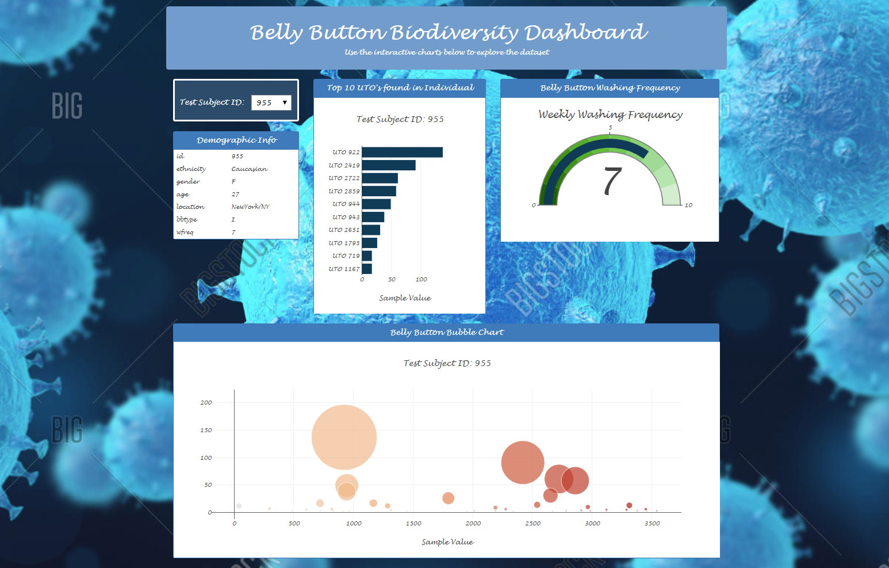

#Week 15: Interactive Data Visualizations
By A. Rijpkema 2/3/2020

A cool feature was added this week. By creating dropdown lists and charts/tables that adjust when a certain value is chosen, interactive Dashboards can be built. Plotly.js takes care of most of it, ones the correct arguments are passed. 

In this assignment we are looking at the different microbes that live inside the belly buttons of human beings. Surprisingly, the different types (UTO's and within them bacteria) vary greatly person to person. The number of times a week, a person shower has seemingly little impact on the subcultures living in our belly buttons. [Here's](Belly_Button_Biodiversity/index.html) the website. It looks like this:  

 

